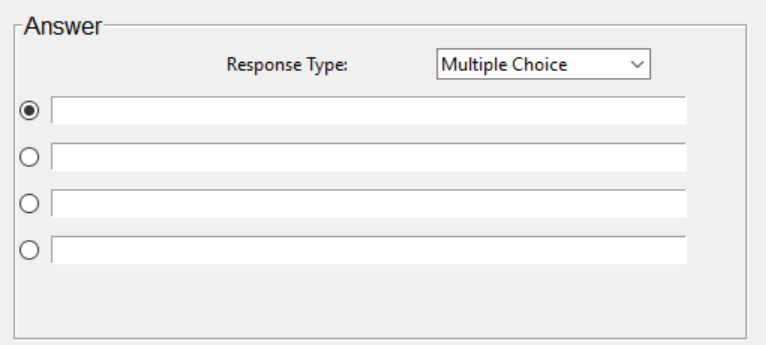
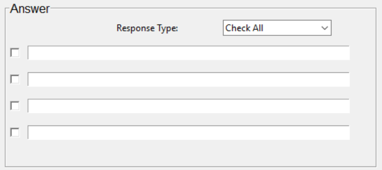
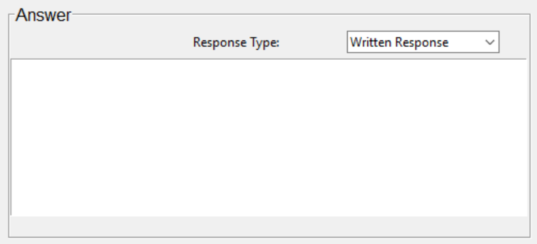
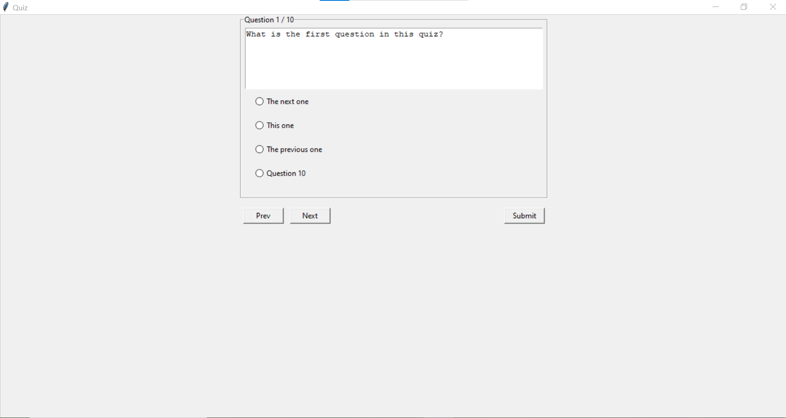

# QuizMaker (GUI program for making and taking quizzes)

# Project Description
This project is a GUI program to create and administer computer quizzes. When run, the program displays a GUI allowing the user to select either “teacher” (quiz creator/admin) or “student” (quiz taker). 

Making the selection for quiz creator gives the user the options required to make any of an assortment of quizzes including multiple choice, true or false, check all that apply, and written response questions. 

When selecting quiz taker, the user is immediately prompted to select a quiz file to open (an example file is included in the repo). Once open, the quiz is presented to the user allowing for question completion, question traversal (via “prev” and “next” buttons), and quiz submission once completed. After submission the quiz score is presented to the user, and the quiz grading is saved to a .txt file locally.

### Technologies Used
This program was written, and run in Windows 10

This project is written in Python and makes imports from tkinter, os, and json.
The GUI made with tkinter is the primary aspect of this project, with two classes built that inherit from tk.Tk. The imports from os and json are both to support data storage, file saving, and file opening.

### Features to be Added Later
In the future, I may change the login screen to perform account password verification from a previously established list of accounts and include a “new account” option. I also may add a feature in the dropdown menu or options menu for a teacher to rearrange the question order. 

# How to Install
Download or clone the repository, and then quizmaker.py is readily available to be run.

# How to Use
Run quizmaker.py and you will be prompted to select either “teacher” or “student” which are selections as to whether you would like to create a quiz or take a quiz, respectively.

### Teacher/quiz maker 
As a teacher, you will see the following screen:

From this screen you can see the spaces for the question list, current question, answer, options, as well as a dropdown menu. The question list is where a small display of all the questions in a quiz will be shown. The question updates automatically as questions are added to the list. It includes a usable scrollbar once the list of questions is too long to fit on screen, and it also allows for question traversal by double clicking questions as well as deleting questions by highlighting them and then pressing the “del” key.

To the right of the sidebar and at the top, you will see the current question space, where the text for a quiz question may be written in, and below it is the answer space. The answer space has a dropdown box to select the question type after which, the corresponding answer selection space will be displayed.

Once a given question type has been selected, you may then fill in the answer options (for multiple choice and check all questions) and select the correct answer. Written response questions have a space for a correct answer, but they are left out when the program calculates a student's quiz score.

Once a quiz has been created, such as the following, you may save the quiz through either of the save options in the dropdown menu, or through key command ctrl+s. This will create a new quiz txt file in your local directory that will then be available to be opened as a teacher for editing during subsequent sessions or as a student to be taken.

### Student/quiz taker
As a student you will immediately be prompted to select quiz file to open:

Once opened, the quiz will be administered, displaying the questions created by the quiz admin. 

When all questions have been completed, you may hit the submit button which will display the number of questions answered correctly out of the total number of questions along with a grade percentage. This data will also be saved to a txt file locally.
